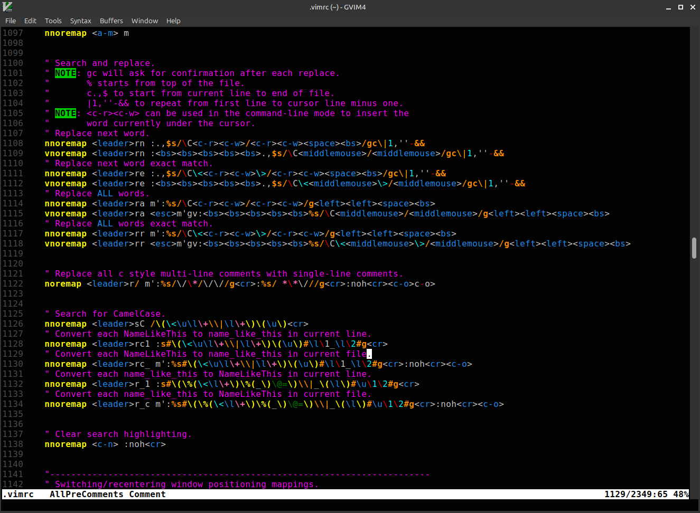
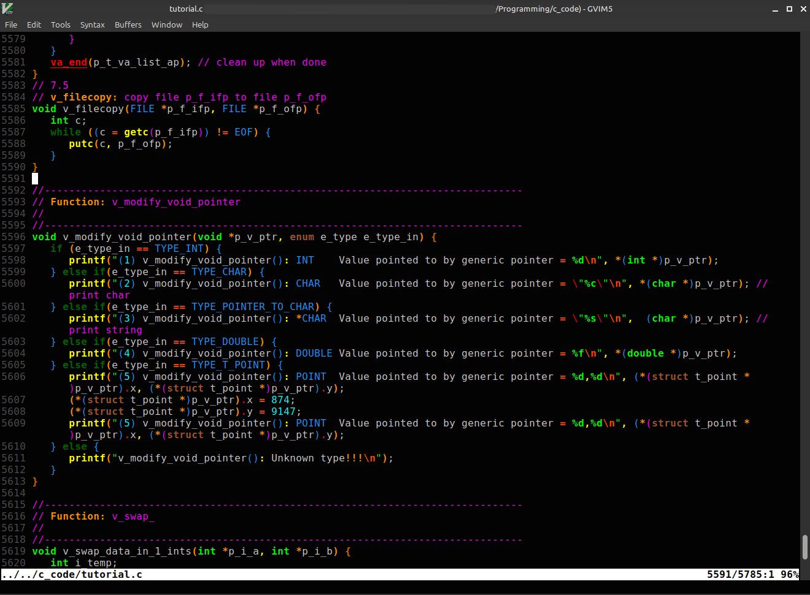
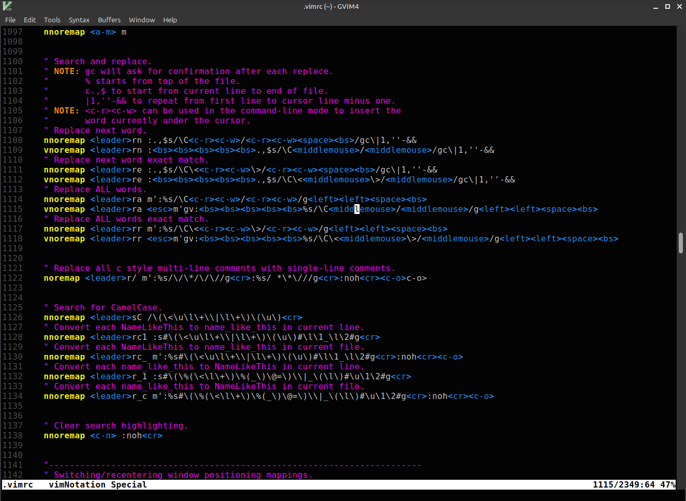
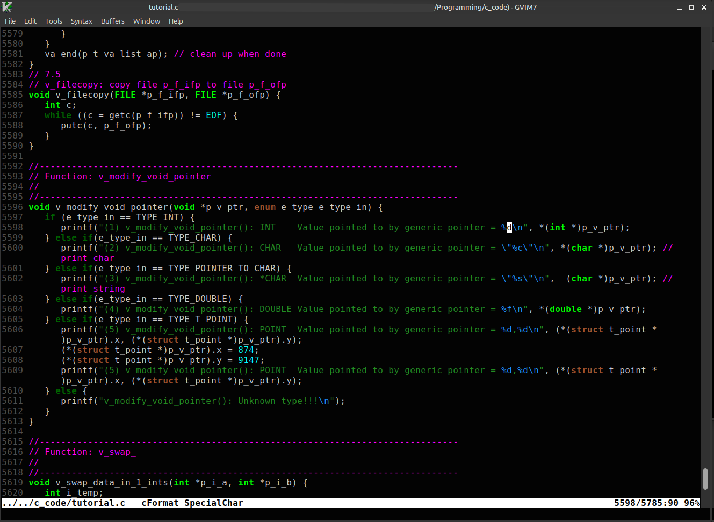

# vimrc

Contains all my vimrc settings.

## Features

- Works in GVim, Vim and NeoVim
- Supports both Windows and Linux OS
- Includes AI Integration with a plugin for using Anthropic's Claude AI via an API (Default is Sonnet 4.6)
- Uses a custom colorscheme where the user has full control over all the colors
- Supports different syntax configuration, can select between Vim's default syntax matching or use a custom syntax highlighting for 20+ file types (default)
- Support for both Colemak-DH and QWERTY keyboard layouts
- Includes performance optimization features, multiple performance modes and large file handling
- Can emulate clipboard utility and copying selections if not supported by default in Vim/NeoVim or even in Windows
- Enables lazyredraw for improved macro execution speed
- Includes custom mappings and abbreviations
- Contains font and GUI customizations
- Improved search and replace usability with mappings
- Contains autocorrect support
- Displays the name of the syntax group being applied under the cursor to make debugging easier

## .vim/ Folder Contents
```
├── abbrevlist.vim          # Abbreviations list for thesaurus lookup
├── abbrev.vim              # Common abbreviations and shortcuts
├── all_colors.vim          # Shows all the available colors in Vim, useful for picking colors
├── all_post.vim            # Applies global custom syntax highlighting after all the respective file settings have been applied
├── all_pre.vim             # Applies global custom syntax highlighting before all the respective file settings have been applied
├── asm.vim                 # Assembly custom syntax highlighting
├── bash.vim                # Bash/shell custom syntax highlighting
├── c.vim                   # C/C++ custom syntax highlighting
├── colors.vim              # Adds additional highlighting groups used throughout the .vim files
├── colors/                 # Contains the custom colorscheme
├── java.vim                # Java custom syntax highlighting
├── latex.vim               # LaTeX custom syntax highlighting
├── lean.vim                # Lean custom syntax highlighting
├── log.vim                 # Log file custom syntax highlighting
├── math.vim                # Math custom syntax highlighting and abbreviations
├── math_mappings.vim       # Math/Unicode mappings from VSCode/Lean
├── netrw.vim               # File browser custom syntax highlighting
├── pack/pasky/start/       # Contains the files for Pasky's plugin for using Anthropic's Claude AI via an API
├── pl.vim                  # Perl custom syntax highlighting
├── py.vim                  # Python custom syntax highlighting
├── rainbow_parenthesis.vim # Highlights each matching set of parenthesis in different colors
├── regex.vim               # Regular expression custom syntax highlighting
├── spell.vim               # Spell checking configurations
├── strikethrough.vim       # Text strikethrough effects
├── sv.vim                  # SystemVerilog custom syntax highlighting
├── svn.vim                 # SVN custom syntax highlighting
├── syntax/                 # Responsible for loading the custom syntax highlighting groups based on file extension
├── tcl.vim                 # TCL custom syntax highlighting
├── txt.vim                 # Plain text custom syntax highlighting
├── unicode.vim             # Unicode support and abbreviations
├── vhdl.vim                # VHDL custom syntax highlighting
└── vim.vim                 # Vim custom syntax highlighting
```

## Pasky's Plugin for using Anthropic's Claude AI

The unmodified Pasky Plugin for using Anthropic's Claude AI can be found at:
https://github.com/pasky/claude.vim

I made some modifications to Pasky's plugins to address some issues I was having, to make the chat experience better suit my personal preferences, to not use the claud_*_prompt.md files (I prefer default prompts), and to add additional comments.

Here is a list of changes that I made with help from the Claude AI:
- Fixed the error "executing job failed: Argument list too long".
- Allow the context window to increase from 200k to 1m. See g:claude_use_1m_context (default set to 200k).
- Updated the claude_model version to use Claude Sonnet 4.6.
- Asked Claude to add a lot of comments.
- Disabled automatic chat folding. See g:claude_enable_folding.
- Print the token usage and cost in the chat after each answer.
- Fix for the printed token usage as it was not always accurate.
- Modified the system prompt to only have the "You:" line. See g:claude_default_system_prompt.
- Increased 'max_tokens' to allow Claude AI to give longer responses before cutting off. See g:claude_max_tokens.
- Add fix for elinks "Update your browser Your browser isn't supported anymore".
- Set g:claude_map_cancel_response = "<c-c>" and have it only affect the Claude chat window.
- Tell Claude to answer from it's knowledge directly and to be very brief.
- Added settings to disable tool and web usage by default. I prefer to keep everything in the chat window, to not let Claude directly edit my files and to keep costs down by not opening large files/websites. Set g:claude_disable_tool_use=0 if you want to enable them.
- Removed automatic indentation in Claude's responses. See g:claude_no_indent.
- Cleared the claud_*_prompt.md files to use Claude's default prompt settings.


## Getting Started

To use, first install GVim, Vim or NeoVim on linux or windows (GVim being my main editor), and then place the .vim files in the appropriate location.
- For linux, place the .vimrc file and the .vim/ folder in ~/ (aka $HOME/ or /home/username/) then open any file with GVim and the settings should all be loaded.
- For Windows, place the .vimrc file and the .vim/ folder under C:\Users\username\ then open any file with GVim and the settings should all be loaded.


## NeoVim

You can get all the vimrc settings to work in NeoVim by placing the files in the proper NeoVim directories or by linking NeoVim to Vim's .vimrc and .vim/ in linux!

This can depend on the specific locations that NeoVim uses in your OS. Below is what works for me in Ubuntu/Mint Linux.

Link Vim's .vimrc and .vim/ files in NeoVim.
```
ln -s ~/.vimrc ~/.config/nvim/init.vim
ln -s ~/.vim ~/.config/nvim/.vim
```
Link the custom colorscheme in NeoVim.
```
ln -s ~/.vim/colors ~/.config/nvim/colors
```
Link Vim's spell checking folder in NeoVim.
```
ln -s ~/.vim/spell ~/.config/nvim/spell
```
Link Pasky's plugin for using Anthropic's Claude AI in NeoVim.
```
ln -s ~/.vim/pack ~/.config/nvim/pack
```

## What my custom colorscheme and custom syntax matching looks like

With g:select_custom_syntax = 3

For vim files:



For C files:



## What my custom colorscheme and Vim's default syntax matching looks like

With g:select_custom_syntax = 1

For vim files:



For C files:




